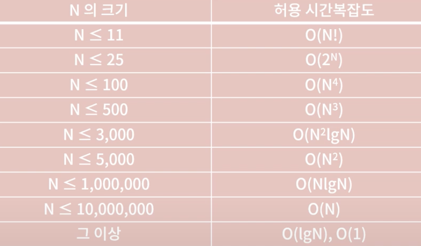

### 0x01 

#### 시간복잡도와 공간복잡도

- 1초 : 3억 개 정도의 연산, for문 하나
- 2초 : 중첩된 for문 (이중중첩까지는 가능) 
- big-O notation : 최악의 경우를 고려하는 시간복잡도 (가장 높은 차수) 
    - O(n) : 선형시간, 선형시간과 상수시간을 포함 
    - O(n^2) : 이차제곱시간, 다항시간
    - O(logN) : 로그시간, binary search
    - ...

```c++
// func1 == 배열에서 5의 배수를 찾는 코드
// O(n)

int func1 (int *arr, int n) {
    int cnt = 0; 
    for (int i = 0; i < n; i++) 
        if (arr[i] % 5 == 0) cnt++;
    return cnt;
}
```




- 예시 
    - 문제에서 언급되는 n이 4000개면 O(n^2) 이하의 알고리즘 사용
    - 문제에서 언급되는 n이 100개면 O(n^4) 이하의 알고리즘 사용
    - 하지만 브루트포스는 예외, operand가 6개면 6차 중첩문을 사용해도 무방할 수 있음

```c++
// 문제 1 
// O(n)

int func1 (int N) {
    int sum = 0; 
    for (int i = 1; i <= N; i++) 
        if (i % 3 == 0 || i % 5 == 0) sum += i;
    return sum;
}
```

```c++
// 문제 2
// 투 포인터 이용하면 편하긴 한데 그냥 이중 중첩으로
// 이중 중첩 : O(n^2)
// 투 포인터 : O(n)

int func2 (int *arr, int N) {
    for (int i = 0; i < N; i++) {
        for (int j = 0; j < N; j++) {
            if (i != j && arr[i] + arr[j] == 100) {
                return 1;
            }
        }
    }
    return 0;
}
```

```c++
// 문제 3
// O(n^0.5) or O(1)

#include <cmath>

int func3 (int N) {
    if (sqrt(N)**2 == N) {
        return 1;
    }
    else {
        return 0;
    }
}
```

```c++
// 문제 4
// O(logn)

#include <cmath>

int func4 (int N) {
    int i = 1
    for (; pow(2, i) < N; i++) {
        ;
    }
    return pow(2, i-1);
}
```

#### 자료형
- 정수
    - char : 1byte 
    - int : 4byte : 2^31 - 1
        - integer overflow : 범위를 넘어가면 음수 범위가 나온다
        - -> long long을 써야 한다
    - long long : 8byte : 2^63 - 1
- 실수
    - float : 4byte
    - double : 8byte
        - 실수로 계산할 땐 double이 낫다
    - 성질
        - (1) 오차는 반드시 발생한다 
            - 그러니깐 double을 써야 오차가 덜함
            - 문제에서 "절대/상대 오차" 라는 말이 나오면 실수를 써서 계산하라는 거고, 그게 아니면 그냥 정수 이용하는 거임
        - (2) 실수를 비교할 땐 등호를 쓰면 안됨